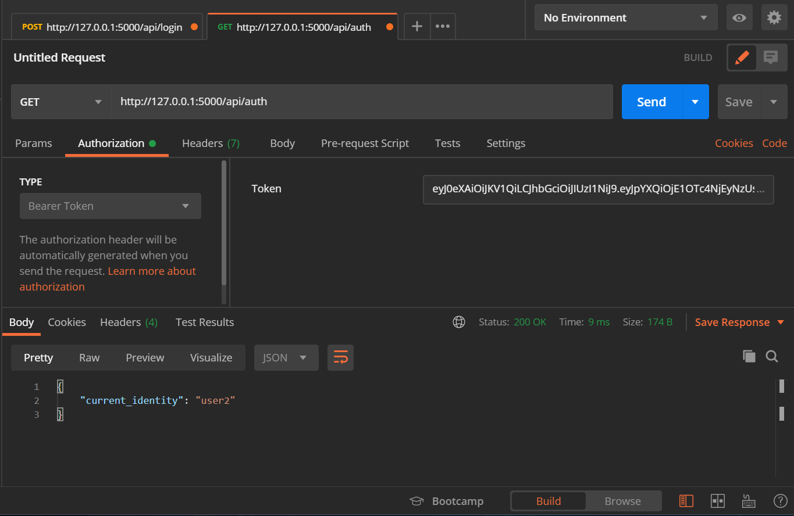

RESTful Flask Application Quick Start
=====================================

This repo provides a quick-start template for creating a RESTful web application using the [Flask](http://flask.pocoo.org/) microframework for Python 3.8+.

Features:
* Flask 1.1.x.
* SQLAlchemy database models
* Marshmallow for object marshalling
* JSON Web Token (JWT) authentication
* Pytest unit-tests

This is a "pure RESTful" application, it exposes only RESTful APIs and does not generate any HTML, perfect for pairing with a single-page-application (SPA) web front-end or mobile app.

See [RESTful Flask application quick-start](http://keathmilligan.net/restful-flask-application-quick-start/) for more info.


## Getting Started

You will need Python 3.8 or later. Use the appropriate installation method for your system to install Python and make sure it is in your path.

### Checkout

Clone or download the repo into a working directory. cd into this directory.

### Create a Python Virtual Environment

Now create a Python virtual environment for this project with:

```
python -m venv .virtualenv
```

### Activate the Virtual Environment

Now activate the virtual environment. on macOS, Linux and Unix systems, use:

```
source .virtualenv/bin/activate
```

On Windows:

```
.virtualenv\Scripts\activate.bat
```

### Install the Development Environment

Now run:

```
pip install -e .[dev,doc]
```

This will install the packages the project depends on along with some additional packages for development. `doc` is optional - it installs Sphinx for documenting your project.

### Run the Unit Tests

To make sure everything is installed and working correctly, run:

```
pytest
```

This will produce a lot of output, but toward the end, you should see something like:

```
======================================================= test session starts ========================================================
platform darwin -- Python 3.5.2, pytest-3.0.3, py-1.4.31, pluggy-0.4.0
rootdir: /Users/kmilligan/workspace/flask-quickstart, inifile: 
collected 11 items 

tests/test_auth.py ......
tests/test_contacts.py .....

==================================================== 11 passed in 2.90 seconds =====================================================
```

## Run the Server

To start the web server, run

### Linux/MacOS:
```
export FLASK_APP=sample
flask run
```

### Windows (cmd):
```
set FLASK_APP=sample
flask run
```

### Windows (PowerShell):
```
$env:FLASK_APP = "sample"
flask run
```

The API will available at http://localhost:5000.

Note that because this app does not generate HTML itself, requesting this URL with a web browser directly will just return a JSON error message. Use a RESTful client application to authenticate and make requests.

## Testing with PostMan

You can test your RESTful APIs with [PostMan](https://www.postman.com/) or another HTTP request tool.

### Authenticate

Send a POST request to `http://127.0.0.1:5000/api/login` with the username/password to login and get an access token:


Copy the access token to the clipboard - you will need it for subsequent requests.

Create a new GET request to `http://127.0.0.1:5000/api/auth` and set the "Authorization" type to "Bearer Token". Paste the access token into the Token field and send the request:



### Get All Contacts


